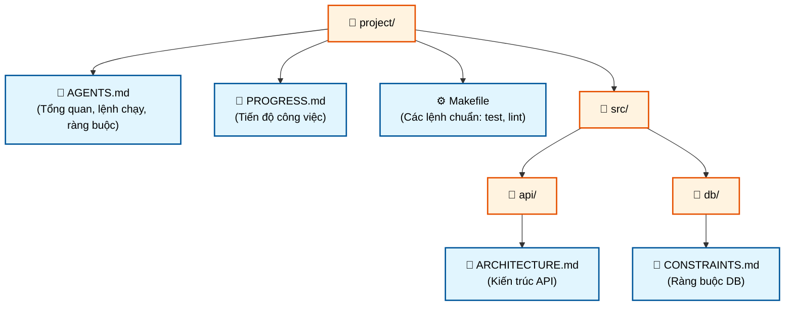

# Bài 3: Tại sao Repository phải trở thành Nguồn thông tin duy nhất (System of Record)

> **Tóm tắt bài học:** Đối với các AI Agent, bất kỳ thông tin nào không tồn tại trong repository (kho lưu trữ mã nguồn) thì coi như không tồn tại. Để agent hoạt động hiệu quả, repository phải trở thành nguồn thông tin duy nhất (single source of truth) chứa mọi quyết định, kiến trúc và ràng buộc của dự án.

## 1. Vấn đề: "Kỹ sư bị nhốt trong Repository"

Với con người, các quyết định kiến trúc có thể nằm rải rác ở Confluence, Slack, Jira, hoặc trong đầu của các kỹ sư trưởng. Con người có thể đi hỏi đồng nghiệp hoặc tìm kiếm trong lịch sử chat. 

Tuy nhiên, **AI Agent không thể làm điều đó**. Đầu vào của một agent chỉ bao gồm:
- System prompt và mô tả nhiệm vụ
- Nội dung các file trong repository
- Kết quả thực thi từ các công cụ (tools)

Mọi thứ bên ngoài repository đều hoàn toàn "mù tịt" với agent. Do đó, nếu bạn sử dụng agent, bạn phải chấp nhận một sự thật: **Agent không thể hỏi con người, mọi thứ nó cần biết phải được viết ra và đặt ở nơi nó có thể tìm thấy.**

## 2. Bài Test Khởi Động Lạnh (Cold-Start Test)

Để kiểm tra xem "bản đồ" (thông tin trong repo) của bạn có đủ tốt hay không, hãy chạy một "cold-start test": Mở một phiên làm việc agent hoàn toàn mới, chỉ cho phép nó truy cập vào repo, và xem liệu nó có thể trả lời 5 câu hỏi cơ bản sau không:

1. Hệ thống này là gì?
2. Nó được tổ chức như thế nào?
3. Làm cách nào để chạy nó?
4. Làm cách nào để kiểm thử (verify) nó?
5. Tiến độ công việc hiện tại đến đâu?

Nếu agent không thể trả lời, bản đồ của bạn đang có "điểm mù". Tại những điểm mù đó, agent sẽ phải đoán. Đoán sai sẽ biến thành bug, và việc phải đoán quá nhiều sẽ làm lãng phí context (ngữ cảnh) của agent.

## 3. Các Khái Niệm Cốt Lõi

- **Khoảng trống Hiển thị Tri thức (Knowledge Visibility Gap):** Tỷ lệ tri thức dự án KHÔNG nằm trong repository. Khoảng trống này càng lớn, tỷ lệ thất bại của agent càng cao.
- **Hệ thống ghi nhận chính thức (System of Record):** Repository phải là tiếng nói có thẩm quyền cuối cùng cho các quyết định, ràng buộc kiến trúc, trạng thái thực thi và tiêu chuẩn kiểm thử. (Nguyên lý "Repo as Spec").
- **Chi phí khám phá (Discovery Cost):** Việc agent phải tốn bao nhiêu budget (token/ngữ cảnh) để tìm ra một thông tin quan trọng. Thông tin càng bị giấu kỹ (ví dụ: ở tận 10 cấp thư mục con), chi phí càng cao.
- **Tốc độ hao mòn tri thức (Knowledge Decay Rate):** Tốc độ mà tài liệu trở nên lỗi thời so với code. Tài liệu lỗi thời còn nguy hiểm hơn là không có tài liệu.
- **Sự tương đồng với ACID:** Áp dụng nguyên lý ACID của cơ sở dữ liệu vào quản lý trạng thái của agent (Xem chi tiết ở phần 5).

## 4. Cách Vẽ Một "Bản Đồ" Tốt Cho Agent

1. **Tri thức phải nằm cạnh code (Knowledge lives next to code):** Quy tắc về API phải nằm trong thư mục API, không phải trong một tài liệu chung chung khổng lồ. Giống như nhãn dán trên kệ thư viện: muốn tìm sách Lịch sử, hãy đến đúng kệ Lịch sử.
2. **Sử dụng file đầu vào tiêu chuẩn:** Cần có file `AGENTS.md` (hoặc `CLAUDE.md`) ở thư mục gốc làm "trang đích" cho agent, để trả lời 3 câu hỏi: Dự án này là gì, Làm sao để chạy, và Làm sao để kiểm thử. (Khoảng 50-100 dòng là đủ).
3. **Tối giản nhưng đầy đủ:** Mỗi thông tin phải có mục đích rõ ràng, nhưng phải đủ để vượt qua bài test "khởi động lạnh". Quá nhiều hay quá ít đều không tốt.
4. **Cập nhật cùng với code:** Gắn liền việc cập nhật tri thức với việc thay đổi code. Cách đơn giản nhất: Đặt tài liệu kiến trúc vào trong từng thư mục module tương ứng, để khi lập trình viên sửa code, họ có thể dễ dàng cập nhật tài liệu.

### Minh họa cấu trúc Repository chuẩn cho Agent

## 5. Quản Lý Trạng Thái Agent Theo Nguyên Lý ACID

Khung nguyên lý quản lý giao dịch trong database (ACID) cực kỳ hữu ích để quản lý state (trạng thái) cho agent:

- **Atomicity (Tính nguyên tử):** Mỗi "thao tác logic" (VD: "thêm endpoint mới và cập nhật tests") chỉ nằm trong 1 git commit. Nếu thất bại giữa chừng, dùng `git stash` để rollback. Tất cả hoặc không gì cả - không có chuyện "làm một nửa".
- **Consistency (Tính nhất quán):** Xác định các điều kiện của một "trạng thái nhất quán" (pass tất cả tests, lint không có lỗi). Agent chạy verify sau mỗi thao tác, không commit những trạng thái lỗi trung gian.
- **Isolation (Tính cô lập):** Tránh "đụng hàng" (race conditions) khi nhiều agent cùng chạy bằng cách dùng nhánh git (branch) riêng biệt hoặc file tiến độ riêng. Hai đầu bếp không thể cùng nêm nếm một nồi canh.
- **Durability (Tính bền vững):** Các thông tin kiến thức quan trọng qua nhiều phiên làm việc (cross-session) phải được lưu (persist) lại vào các file được git theo dõi. Trạng thái lưu tạm thời trong session memory sẽ mất. Những gì có trong đầu bạn không tính, chỉ những gì nằm trên "giấy" (file) mới tính.

## Tóm lại
Một file `ARCHITECTURE.md` 50 dòng nằm ngay ngắn trong thư mục `src/api/` hữu ích gấp mười nghìn lần một bản thiết kế 500 trang vứt trên Confluence mà chẳng ai buồn bảo trì. Để AI Agent làm việc hiệu quả, hãy mang mọi tri thức quay trở về với Code Repository!
