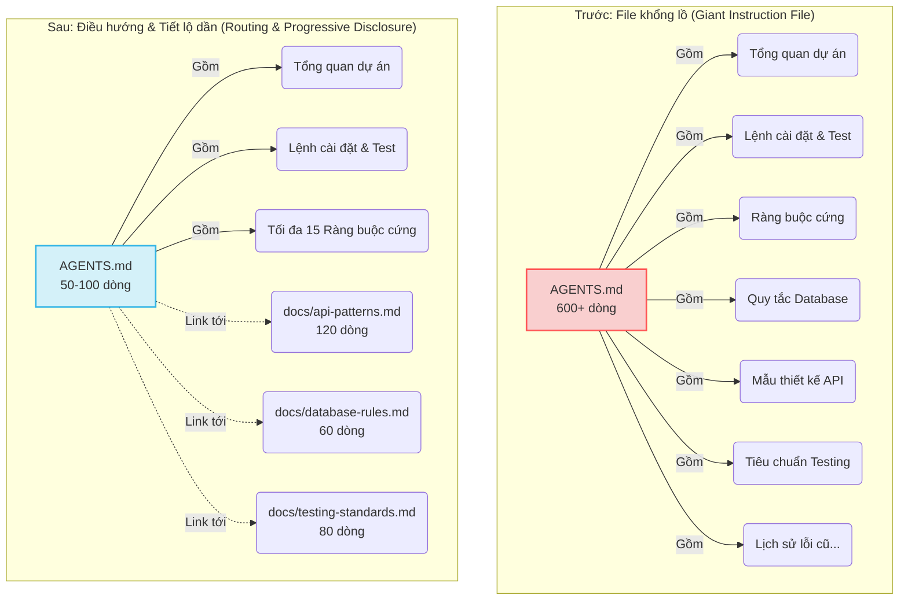

# Bài học 04: Tại sao một file hướng dẫn (instruction file) khổng lồ lại thất bại

**Nguồn:** [Why One Giant Instruction File Fails](https://walkinglabs.github.io/learn-harness-engineering/en/lectures/lecture-04-why-one-giant-instruction-file-fails/)

---

## 1. Vấn đề "Nhồi nhét quá mức" (The "Giant Instruction File" Trap)
Khi bạn cố gắng đưa mọi quy tắc, ràng buộc và bài học kinh nghiệm vào một file `AGENTS.md` duy nhất, file này sẽ phình to lên nhanh chóng (từ 50 lên hàng trăm dòng). Mặc dù mục đích là "thêm quy tắc để tránh agent lặp lại sai lầm", điều này thực chất lại làm giảm hiệu suất của Agent. Giống như việc nhét quá nhiều đồ đạc vào một chiếc vali: mọi thứ đều có vẻ hữu ích nên bạn cứ nhồi nhét vào, để rồi cuối cùng không thể tìm thấy thứ mình thực sự cần.

## 2. Vòng lặp ác tính (The Vicious Cycle)
Vòng lặp phổ biến thường diễn ra như sau:
*Agent mắc lỗi* $\rightarrow$ *Bạn thêm quy tắc vào `AGENTS.md`* $\rightarrow$ *Tạm thời hiệu quả* $\rightarrow$ *Agent mắc lỗi khác* $\rightarrow$ *Thêm quy tắc khác* $\rightarrow$ **File phình to mất kiểm soát.**

**Hậu quả:**
- **Tiêu tốn bộ nhớ ngữ cảnh (Context Budget):** Khi file hướng dẫn quá lớn (ví dụ chiếm 10-15% cửa sổ ngữ cảnh), Agent không còn đủ dung lượng bộ nhớ cho việc đọc mã nguồn, lưu kết quả chạy tool hay ghi nhớ lịch sử trò chuyện.
- **Hiệu ứng "Lạc ở khúc giữa" (Lost in the Middle):** Các nghiên cứu chỉ ra rằng các mô hình ngôn ngữ lớn (LLM) thường bỏ qua hoặc ghi nhớ kém các thông tin nằm ở phần giữa của một văn bản dài. Một ràng buộc bảo mật quan trọng nếu nằm ở dòng 300 của một file 600 dòng có xác suất rất cao sẽ bị phớt lờ hoàn toàn.
- **Xung đột ưu tiên (Priority Conflicts):** Ràng buộc cứng, nguyên tắc thiết kế, và ghi chú fix lỗi lịch sử bị trộn lẫn với nhau khiến Agent không thể phân biệt được mức độ quan trọng.
- **Khó bảo trì (Maintenance Decay):** File dài rất khó quản lý. Mọi người thường chỉ thêm quy tắc mới chứ hiếm khi xóa quy tắc cũ vì sợ ảnh hưởng. Điều này dẫn đến sự tích tụ nợ kỹ thuật (technical debt).
- **Mâu thuẫn tích tụ:** Các hướng dẫn được thêm vào ở những thời điểm khác nhau có thể mâu thuẫn với nhau (ví dụ: một chỗ bảo dùng "TypeScript strict mode", chỗ khác lại bảo "được phép dùng mọi type cho file cũ"), khiến Agent bối rối chọn bừa.

## 3. Kiến trúc hướng dẫn (Instruction Architecture)

**Nguyên tắc cốt lõi:** Những thông tin dùng thường xuyên thì để ở ngoài (dễ lấy), thông tin thỉnh thoảng mới dùng thì cất đi (có tổ chức), và bỏ đi những thứ không bao giờ dùng tới.

### Minh họa Kiến trúc: Trước và Sau khi tối ưu

### Cách triển khai cụ thể:
1. **Entry File (`AGENTS.md` làm Router):**
   - Giới hạn 50-200 dòng.
   - Chỉ bao gồm: Tổng quan dự án (1-2 câu), lệnh khởi chạy nhanh, các ràng buộc cứng (không quá 15 quy tắc bất di bất dịch), và các đường link dẫn tới các file tài liệu chuyên đề.
   - **Mẹo:** Đặt các thông tin quan trọng nhất ở đầu hoặc cuối file để tránh hiệu ứng "Lost in the middle".
2. **Tài liệu theo chủ đề (Topic Docs):**
   - Các file chi tiết (50-150 dòng) nằm trong thư mục `docs/`. Agent sẽ chỉ tìm đọc chúng khi nào thực sự cần thiết (Progressive Disclosure).
3. **Tích hợp vào code (In-code context):**
   - Thay vì ghi vào file hướng dẫn, hãy đặt định nghĩa kiểu (type definitions), giao diện (interfaces), hoặc comment giải thích trực tiếp vào mã nguồn để Agent đọc một cách tự nhiên.
4. **Vòng đời của hướng dẫn:**
   - Mỗi hướng dẫn cần có: Nguồn gốc ("tại sao quy tắc này ra đời?"), điều kiện áp dụng ("khi nào cần dùng?"), và điều kiện hết hạn ("khi nào có thể xóa bỏ?"). Thường xuyên kiểm tra và xóa bỏ hướng dẫn lỗi thời.

## 4. Ví dụ thực tế
Một nhóm SaaS có file `AGENTS.md` dài 600 dòng. Agent liên tục tốn thời gian đọc các hướng dẫn triển khai không liên quan khi đang fix bug, và thường xuyên phớt lờ ràng buộc bảo mật ở dòng 300.
**Sau khi dọn dẹp lại ("Suitcase reorganization"):**
- Cắt giảm `AGENTS.md` xuống còn 80 dòng (chỉ giữ lại Router và ràng buộc cứng).
- Tách phần còn lại ra `docs/api-patterns.md`, `docs/database-rules.md`, v.v.
- Các ghi chú sửa lỗi lịch sử được chuyển hóa thành Unit Test hoặc bị xóa.

**Kết quả:** 
- Tỷ lệ thành công của tác vụ tăng từ **45% lên 72%**.
- Tỷ lệ tuân thủ các ràng buộc bảo mật tăng từ **60% lên 95%** (vì ràng buộc được đưa lên đầu file Router, thoát khỏi hiệu ứng "Lost in the middle").

## 5. Tổng kết (Key Takeaways)
- Việc "Thêm một quy tắc nữa" chỉ là liều thuốc giảm đau tạm thời nhưng là liều thuốc độc về lâu dài. Hãy hỏi: "Quy tắc này có hợp nằm ở file chủ đề riêng không?".
- File hướng dẫn gốc (Entry file) chỉ nên làm **Bộ định tuyến (Router)**, không phải bách khoa toàn thư.
- Quản lý sự phình to của file hướng dẫn giống như quản lý **Nợ kỹ thuật (Technical debt)**. Thường xuyên dọn dẹp và phân loại rạch ròi.
- Cải thiện tỷ lệ Tín hiệu/Nhiễu (Signal-to-Noise Ratio) giúp Agent dành nhiều bộ nhớ ngữ cảnh hơn cho việc xử lý công việc thực sự.
